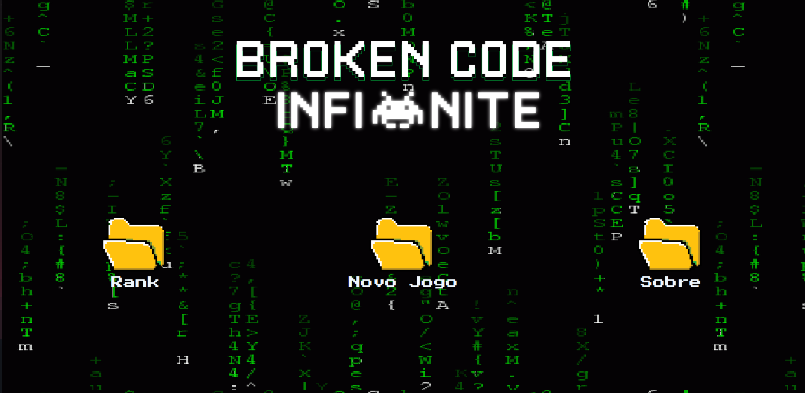

**Jogo de Plataforma 2D - Projeto Integrador TI93 Senac Santana**

Este é o repositório do projeto de plataforma 2D desenvolvido como parte do curso técnico de Tecnologia da Informação (TI) da turma TI93 do Senac Santana. Este projeto tem como objetivo criar um jogo de plataforma 2D interativo e envolvente, além de abordar conceitos essenciais de desenvolvimento web e autenticação de usuários.

**Recursos e Funcionalidades:**
- Autenticação de Usuários: Implementação de um sistema de autenticação seguro, permitindo que os jogadores se registrem e façam login para acessar o jogo.
- Sistema de Pontuação: Acompanhe e registre as pontuações dos jogadores em uma tabela dedicada, associando as pontuações aos usuários registrados.
- Interface Amigável: Utilização de modais Bootstrap para formulários de login e registro, proporcionando uma experiência de usuário intuitiva.
- Feedback Visual: Mensagens de feedback dinâmicas utilizando flash messages para notificar os jogadores sobre o progresso do login e registro.
- Organização do Código: Separação clara das rotas, controladores e modelos para garantir um código bem estruturado e de fácil manutenção.

**Como Executar o Projeto:**
1. Clone o repositório para sua máquina local usando `git clone https://github.com/MurilloYonamine/Projeto-Jogo-2D.git`.
2. Navegue até o diretório do projeto usando `cd Projeto-Jogo-2D`.
3. Instale as dependências utilizando `npm install`.
4. Execute o servidor local usando `npm start`.
5. Acesse o jogo em `http://localhost:3000`.

Este projeto é uma realização conjunta da turma TI93 do Senac Santana e foi guiado pelas instruções e conhecimentos do professor Rogério. O jogo de plataforma 2D busca inspiração no cotidiano dos alunos e professores, proporcionando uma experiência de jogo única e divertida. Se você tiver alguma dúvida ou feedback sobre o projeto, sinta-se à vontade para entrar em contato com a equipe de desenvolvimento.

*Autor: TI93*
*Turma: TI93 - Senac Santana*
*Instrutor: Prof. Rogério*
